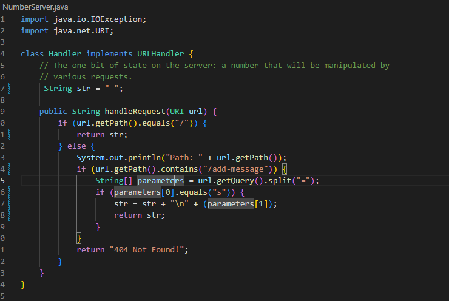
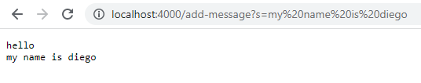
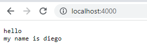
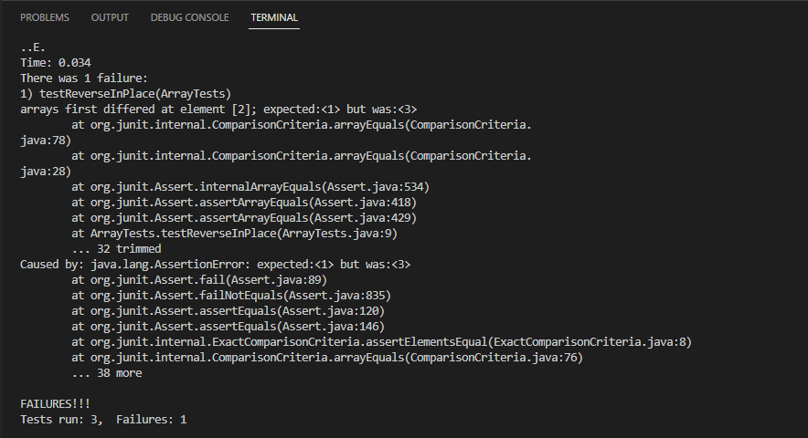
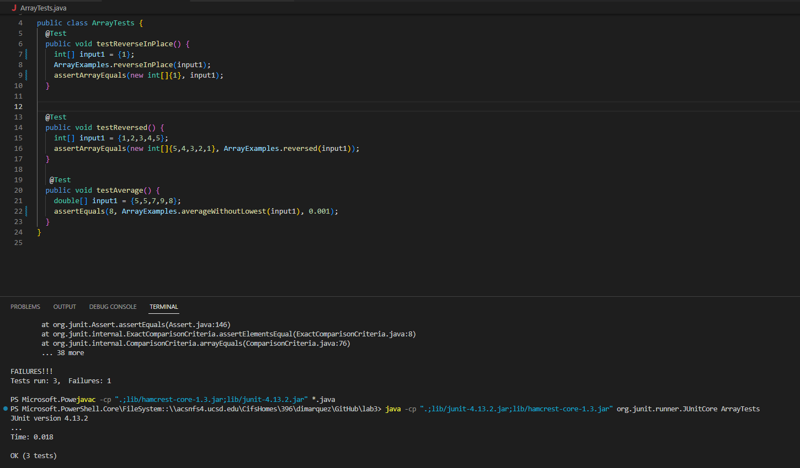

Part 1
======
**Modifying NumberServer to StringServer!**



Modifying the handlerequest method allowed me to return a string that concatenates 
strings to itself while adding a new line everytime!

The handlerequest method is called on upon entering the website, 
I get the path from the URL and check if it says "add-message", if so,
I then get the query splitting it at the '='. Finally I concatenate the string after the '='
to the original string which started off as an empty string!

**Inputs:**

*URL = localhost:4000/add-message?s=hello*
*URL = localhost:4000/add-message?s=my name is diego*

**Output:**




*Note: the only value being changed here is the string variable within the StringServer class,
which concatenates to itself the string after the query '=' and adds a new line everytime! This 
only happens when the path contains the 'add-message' command.*

**Input:**

*URL: localhost:4000/*

**Output:**



*Note: here there is no path added to the URL which just returns the same string without
adding a new line or concatenating a new string! There are no values being changed as the path
is empty, therefore the string is returned unchanged.* 

Part 2
======

I chose the bug present in the ReverseInPlace method!
Failure inducing input:
```
@Test
public void testReversedInPlace() {
  int[] input1 = {1,2,3}
  ArrayExamples.reverseInPlace(input1);
  assertArrayEquals(new int[]{3,2,1}, input1);
 }
 ```
 **Junit Test:**
 
 
 
 **Non-Failure inducing input:**
 
 @Test
public void testReversedInPlace2() {
  int[] input1 = {1}
  ArrayExamples.reverseInPlace(input1);
  assertArrayEquals(new int[]{1}, input1);
 }
 ```
 **Junit Test:**
 
 
 
 **reverseInPlace before code:**
 ```
 static void reverseInPlace(int[] arr) {
    for(int i = 0; i < arr.length; i += 1) {
      arr[i] = arr[arr.length - i - 1];
    }
  }
  ```
  
  **reverseInPlace fix:**
  ```
  static void reverseInPlace(int[] arr) {
    for(int i = 0; i < arr.length / 2; i++){
      int temp = arr[i];
      arr[i] = arr[arr.length - i - 1];
      arr[arr.length - i - 1] = temp;
   }
   ```
   **Note:**
   This fixes the issue in the code because in the original method, the first half 
   of the elements were lost when reversing the string. Making a temporary int
   variable allows us to keep track of the first half of the elements.
   
   Part 3
   ======
   
   I've learned a great deal from week 2 and 3. I learned how to work the basics with 
   JUnit which allows me to check for bugs in my code far more efficiently. Not only that
   but, I've learned how to better start adressing bugs in my program by looking at the
   different symptoms that appear due to different inputs. Finally, I feel like my use
   of Markdown is getting better as well given both the first and second lab are written in it.
   I'm looking forward to learning more in this class!
 
